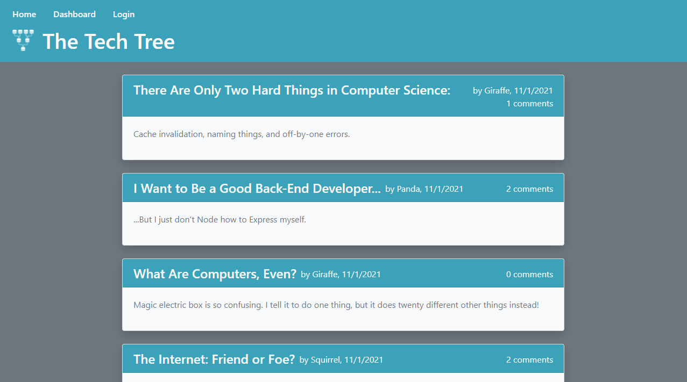
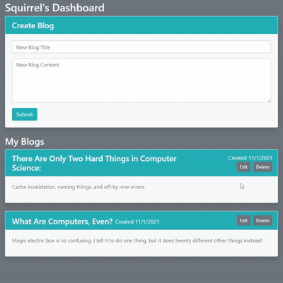
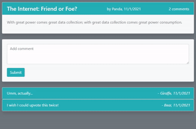

# Tech Blog

This is a blog site that allows posting, deleting, and editing of blogs. When not logged in, a user can view created blogs and their comments. 

After logging in or creating an account, a user can then post, edit, or delete their own blogs from their account dashboard page. 

Also while logged in, a user can post or delete their own comments on any blog's page.

## Deployed Page

* [See live site here](https://secret-harbor-03518.herokuapp.com/).

---

## Getting Started

These instructions will get you a copy of the project up and running on your local machine for development and testing purposes. See deployment for notes on how to deploy the project on a live system.

### Prerequisites

* IDE to view/edit source code (e.g. Visual Studio Code).
* [Node.js](https://nodejs.org/en/)
* [MySQL](https://www.mysql.com/)

### Installing

1. Clone repository.
1. Navigate to `tech-blog` directory in terminal.
1. `npm install` dependencies.
1. Add MySql user name and password to `.envEXAMPLE` file and change file name to `.env`.
1. Initialize database in SQL with `source db/schema.sql`.
1. If desired, seed database with `npm run seed`.
1. Run with `npm start`.

### Deployment

1. Upload to webhosting service, such as [Heroku](https://www.heroku.com/).
1. Attach database addon, such as [jawsDB](https://www.jawsdb.com/).

---

## Built With

* [Sequelize ORM](https://sequelize.org/)
* [MySQL2](https://www.npmjs.com/package/mysql2)
* [Express.js](http://expressjs.com/)
* [Node.js](https://nodejs.org/en/)

## Author

Vince Lee
- [Portfolio](https://starryblue7.github.io/portfolio-ii/)
- [Github](https://github.com/StarryBlue7)
- [LinkedIn](https://www.linkedin.com/in/vince-lee/)

## License

[MIT License](https://vince-lee.mit-license.org/)

## Acknowledgments

* Password encryption by [bycrypt](https://www.npmjs.com/package/bcrypt).
* Session maintenance via [express-session](https://www.npmjs.com/package/express-session).
* Database service provided by [jawsDB](https://www.jawsdb.com/).
* Webhosting by [Heroku](https://www.heroku.com/).